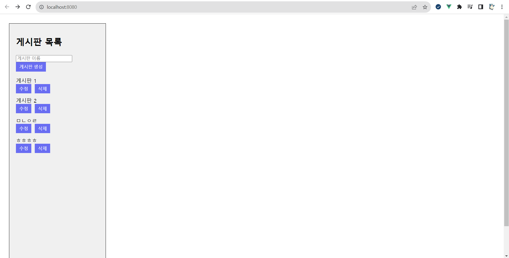
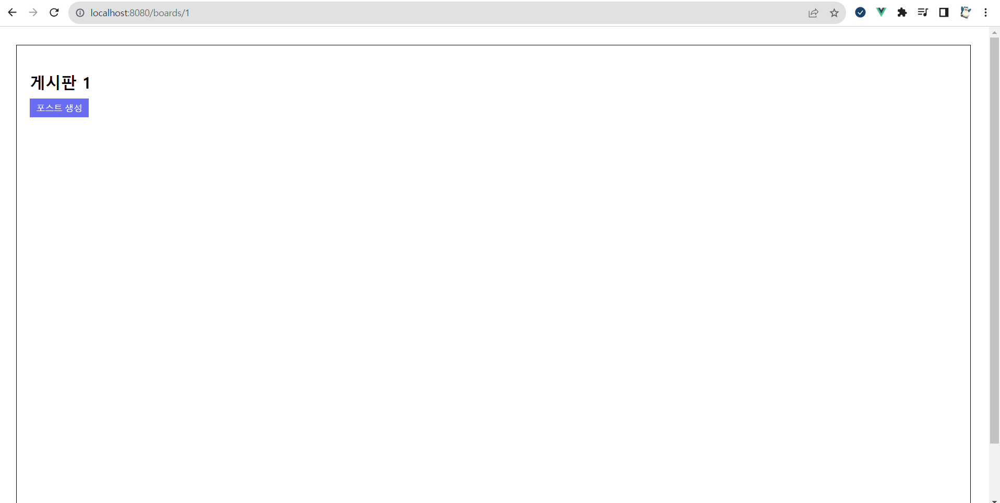
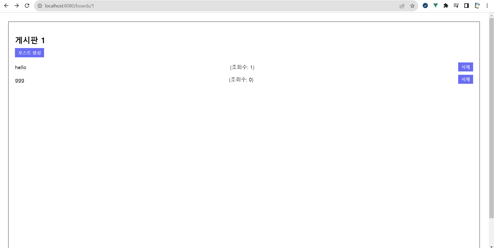
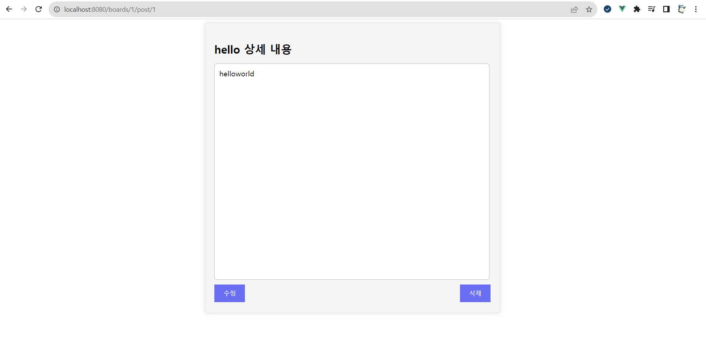

# board_api

vue3로 게시판 restapi 간단 구현

```
Board = {
  id
  name
  post=[id, name, detail]
}
```

| Method | URL                           | 설명             |
| ------ | ----------------------------- | ---------------- |
| POST   | /boards                       | 게시판 생성      |
| GET    | /boards                       | 전체 게시판 읽기 |
| GET    | /boards/:boardId              | 개별 게시판 읽기 |
| PUT    | /boards/:boardId              | 게시판 수정      |
| DELETE | /boards/:boardId              | 게시판 삭제      |
| POST   | /boards/:boardId/post         | 포스트 생성      |
| GET    | /boards/:boardId/post         | 전체 포스트 읽기 |
| GET    | /boards/:boardId/post/:postId | 개별 포스트 읽기 |
| PUT    | /boards/:boardId/post/:postId | 포스트 수정      |
| DELETE | /boards/:boardId/:postId      | 포스트 삭제      |

## 실행

- 서버 실행 `node ./routes/serve.js`
- 프론트 실행 `npm run serve`

## 결과





